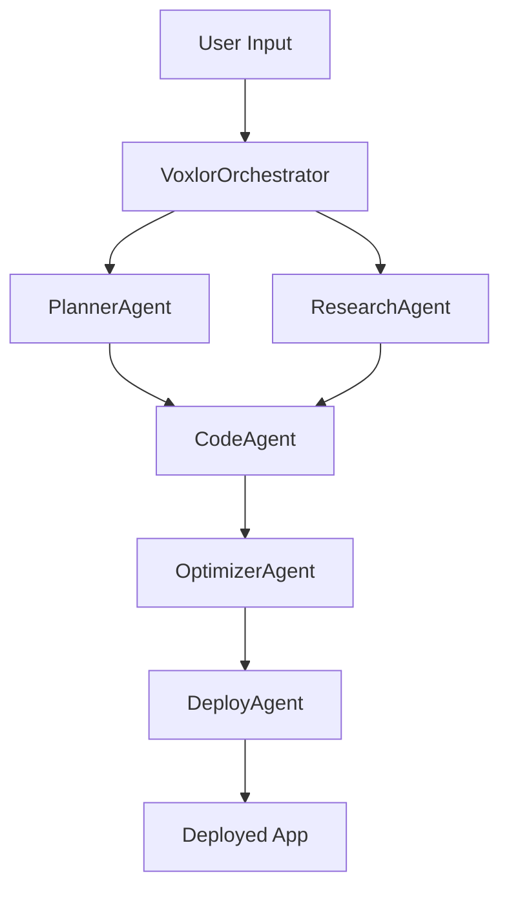

# VOXLOR - AI-Powered App Generation Platform

🚀 **VOXLOR** is an autonomous AI app builder that generates web, mobile, and AR applications from natural language prompts using advanced multi-agent orchestration.

## ✨ Features

### 🤖 Multi-Agent AI System
- **VoxlorOrchestrator**: Main coordination hub for all AI agents
- **PlannerAgent**: App structure and feature planning
- **CodeAgent**: Code generation and optimization
- **DeployAgent**: Multi-platform deployment (Vercel, Netlify, Railway, AWS)
- **ResearchAgent**: Market research and insights
- **OptimizerAgent**: Performance, security, and maintainability optimization

### 🎯 Core Capabilities
- **Natural Language Processing**: Generate apps from simple text descriptions
- **Multi-Platform Support**: Web, Mobile, Desktop, AR applications
- **Real-time Code Generation**: Live preview and instant deployment
- **AI-Powered Research**: Market analysis and competitor insights
- **Automated Deployment**: One-click deployment to multiple platforms
- **Code Optimization**: Performance, security, and maintainability improvements

### 🛠️ Tech Stack
- **Frontend**: React 18, TypeScript, Tailwind CSS, Electron
- **Backend**: Node.js, Express, TypeScript
- **AI/ML**: VOXLOR LLM system, OpenAI, Anthropic, Google Gemini
- **Deployment**: Vercel, Netlify, Railway, AWS S3
- **Database**: PostgreSQL, Redis
- **Testing**: Vitest, Playwright, Jest

## 🚀 Quick Start

### Prerequisites
- Node.js >= 20
- npm or yarn
- Git

### Installation

1. **Clone the repository**
   ```bash
   git clone https://github.com/your-username/voxlor.git
   cd voxlor
   ```

2. **Install dependencies**
   ```bash
   # Install main project dependencies
   npm install
   
   # Install VOXLOR dependencies
   cd VOXLOR
   npm install
   ```

3. **Start VOXLOR**
   ```bash
   cd VOXLOR
   npm start
   ```

4. **Test the system**
   ```bash
   # Run the test suite
   node test-voxlor.js
   ```

## 📖 Usage

### Basic App Generation

1. **Launch VOXLOR** - Start the Electron application
2. **Describe your app** - Enter a natural language description
3. **Select platform** - Choose web, mobile, or desktop
4. **Generate** - Watch AI agents create your app
5. **Deploy** - One-click deployment to your preferred platform

### Example Prompts
- "Create a todo list app with drag-and-drop functionality"
- "Build a weather dashboard with real-time data"
- "Make a simple calculator with scientific functions"
- "Generate a social media dashboard with analytics"

### AI Agent Workflow



## 🏗️ Architecture

### Multi-Agent System
Each AI agent specializes in specific tasks:

- **PlannerAgent**: Analyzes requirements and creates app structure
- **CodeAgent**: Generates TypeScript/React code using VOXLOR LLM
- **DeployAgent**: Handles deployment to multiple platforms
- **ResearchAgent**: Performs web research and market analysis
- **OptimizerAgent**: Optimizes code for performance and security
- **VoxlorOrchestrator**: Coordinates all agents and manages workflow

### LLM Integration
- **Primary**: VOXLOR LLM system with multiple providers
- **Providers**: OpenAI GPT-4/5, Anthropic Claude, Google Gemini
- **Fallbacks**: OpenRouter, Ollama, LM Studio
- **Local Models**: Hugging Face Transformers (CodeLlama, Mistral)

## 🔧 Configuration

### Environment Variables
Create a `.env` file in the VOXLOR directory:

```env
# LLM Configuration
OPENAI_API_KEY=your_openai_key
ANTHROPIC_API_KEY=your_anthropic_key
GOOGLE_API_KEY=your_google_key

# Deployment Configuration
VERCEL_TOKEN=your_vercel_token
NETLIFY_TOKEN=your_netlify_token
RAILWAY_TOKEN=your_railway_token
AWS_ACCESS_KEY_ID=your_aws_key
AWS_SECRET_ACCESS_KEY=your_aws_secret

# Database Configuration
DATABASE_URL=your_database_url
REDIS_URL=your_redis_url
```

### VOXLOR Settings
Configure AI agents and deployment preferences in the VOXLOR interface:
- LLM provider selection
- Deployment platform preferences
- Code optimization settings
- Research parameters

## 📊 Project Structure

```
voxlor/
├── src/
│   ├── agents/           # AI Agent implementations
│   │   ├── VoxlorOrchestrator.ts
│   │   ├── PlannerAgent.ts
│   │   ├── CodeAgent.ts
│   │   ├── DeployAgent.ts
│   │   ├── ResearchAgent.ts
│   │   └── OptimizerAgent.ts
│   ├── llm/             # LLM integration
│   │   └── LLMInterface.ts
│   ├── research/        # Web research capabilities
│   │   └── WebResearch.ts
│   └── components/      # UI components
│       └── ui/
├── VOXLOR/              # Main VOXLOR application
│   ├── src/
│   │   ├── components/  # React components
│   │   ├── pages/       # Application pages
│   │   ├── ipc/         # IPC handlers
│   │   └── main.ts      # Electron main process
│   └── package.json
├── test-voxlor.js       # Test suite
└── README.md
```

## 🧪 Testing

### Run Test Suite
```bash
node test-voxlor.js
```

### Test Individual Components
```bash
# Test AI agents
npm run test:agents

# Test deployment
npm run test:deploy

# Test research
npm run test:research
```

## 🚀 Deployment

### VOXLOR App Deployment
VOXLOR can deploy generated apps to multiple platforms:

- **Vercel**: Automatic deployment with custom domains
- **Netlify**: Static site hosting with form handling
- **Railway**: Full-stack app deployment
- **AWS S3**: Static website hosting

### Self-Hosting
Deploy VOXLOR itself using:
- Docker containers
- Vercel/Netlify for web interface
- Railway for full-stack deployment

## 🤝 Contributing

We welcome contributions! Please see our [Contributing Guidelines](CONTRIBUTING.md) for details.

### Development Setup
1. Fork the repository
2. Create a feature branch
3. Make your changes
4. Add tests
5. Submit a pull request

## 📄 License

This project is licensed under the MIT License - see the [LICENSE](LICENSE) file for details.

## 🙏 Acknowledgments

- **VOXLOR Team** - Core development
- **OpenAI** - GPT models and API
- **Anthropic** - Claude models
- **Google** - Gemini models
- **Vercel** - Deployment platform
- **Electron** - Desktop app framework

## 📞 Support

- **Documentation**: [docs.voxlor.sh](https://docs.voxlor.sh)
- **Issues**: [GitHub Issues](https://github.com/your-username/voxlor/issues)
- **Discord**: [VOXLOR Community](https://discord.gg/voxlor)
- **Email**: support@voxlor.sh

## 🎯 Roadmap

- [ ] **Phase 1**: Core AI agent system ✅
- [ ] **Phase 2**: Planning & Design ✅
- [ ] **Phase 3**: MVP Development ✅
- [ ] **Phase 4**: Advanced Features & Optimization
- [ ] **Phase 5**: Enterprise & Scaling

---

**Made with ❤️ by the VOXLOR Team**

*Empowering developers to build amazing applications with AI*
